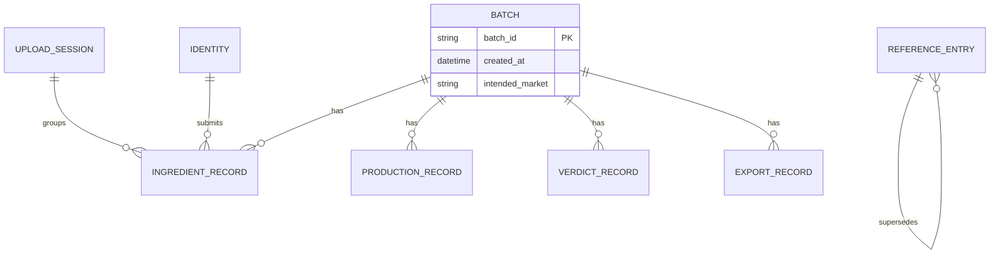

# HALCHECK — Technical Requirements Document (TRD)

## Document Control

- Project: HALCHECK
- Module: Compliance Trail
- Repository: `halcheck`
- Status: Design complete
- Version: 0.3.0-planning

## Changelog

- **v0.2.0:** Added batch-level `intended_market`, fail `flagged_record_id`, and single-record correction linkage to match FRD/ERD updates. Export no longer accepts destination as a user-entered value.
- **v0.3.0:** Adopted pre-build authority-closure contracts for chaincode-owned reference validation, signed verdict attestations, fail-closed audit delivery, field-level RBAC, and production corrections.

## 1. Technical Strategy

Ledger-first architecture. The blockchain network (peers, ordering service, chaincode) owns all accountability-relevant state — who submitted what, when, and whether a sequencing rule was satisfied. The web application and its backend API are clients of that ledger, not sources of truth for anything requiring tamper-evidence. This principle explicitly extends to reference data (Section 10) and the audit log (Section 12) — both are also non-editable, append-only stores, following the same discipline as batch records.

```text
browser -> frontend -> backend API -> Fabric Gateway SDK -> chaincode -> ledger
                              |                                    |
                              -> PostgreSQL (non-authoritative)     -> reference data (on-ledger, versioned)
                              -> file storage (off-chain, hash on-chain)
                              -> System Audit Log (Postgres, insert-only enforced at DB level)
                              -> LLM API (read-only context, batch data only)
```

## 2. Target Platform

| Platform | Status | Notes |
|---|---|---|
| macOS (Apple Silicon) | Primary target | Native Docker Desktop support; some Fabric tooling remains Linux-first, occasional friction possible |
| Linux | Compatible, untested in this scope | Fabric's native environment |
| Windows | Not targeted | Would require WSL2; out of scope for this release |

## 3. Proposed Structure

```text
halcheck/
|-- chaincode/
|   |-- batch/           # independently deployable chaincode definition
|   |   `-- go.mod
|   `-- refdata/          # independently deployable chaincode definition
|       `-- go.mod
|-- backend/
|   |-- src/
|   |   |-- routes/          # batch/verdict/export routes
|   |   |-- admin/            # reference data + audit log routes, System Admin only
|   |   |-- ai/                 # trail explanation endpoint
|   |   `-- rbac/                # field-level access matrix enforcement
|   |-- .env.example
|   `-- package.json
|-- frontend/
|   |-- src/
|   |-- public/
|   |-- .env.local.example
|   `-- package.json
|-- network/
|   |-- connection-profile.example.json
|   |-- configtx.yaml
|   `-- crypto-config.yaml
|-- docker-compose.yml
`-- docs/
```

`chaincode/batch/` and `chaincode/refdata/` are two separate Go modules with independent `go.mod` files — two chaincode definitions on the same channel, independently upgradable. A bug fix to reference-data logic does not require redeploying batch logic, and vice versa.

## 4. Entity-Relationship Diagram

See `06_erd.md` for the full entity dictionary, field types, and cardinality notes. Summary:



`Batch` remains deliberately small, but now includes immutable `intended_market`, captured at creation so recognition-directionality can be evaluated before verdict recording. Status is never stored on the ledger; it is computed by the backend from the latest child record present for that batch, cached in PostgreSQL.

## 5. Reference Data Linkage — Resolved

**Decision: denormalized snapshot, not a live foreign key.** Every record type that references standards, ingredients, suppliers, or fail reasons stores the resolved `entry_id`, version, canonical value, and approved metadata needed by that record at submission time — not a live foreign key to a `REFERENCE_ENTRY` row that could later be superseded. `batch` obtains this snapshot from `refdata.ResolveActiveReference` in the same ledger transaction; a backend lookup is never authoritative. `REFERENCE_ENTRY` still tracks its own supersession chain for the Reference Data List's history view, but batch records never live-join against it.

A batch record is a self-contained fact the moment it's written — matching the ledger's event-sourced nature. A live-referenced version would require the reference table to itself never mutate a row, duplicating work already required for its own deprecation logic.

## 6. Core Runtime Requirements

- Node.js LTS for backend and tooling.
- Go (stable) for chaincode.
- Chaincode contains business rules only — no orchestration, no I/O beyond ledger state. Extended to include reference-data versioning rules, not just batch sequencing rules.
- Backend never holds unilateral authority over anything chaincode governs; it is a routing/translation layer only — extended explicitly to reference data (System Admin actions still go through chaincode, not a direct database write).

## 7. Blockchain Layer Requirements

| Component | Requirement |
|---|---|
| Network | Based on official `fabric-samples` test-network, not built from scratch |
| Ordering | Raft-based ordering service (single node acceptable at this scale) |
| Identity | Fabric CA issues one certificate per role; no role logic accepted from client-supplied strings |
| State database | CouchDB, to support field-level queries against ledger state |
| Chaincode language | Go, split into `batch` and `refdata` modules (Section 3) |
| Chaincode testing | Every state-changing function requires a paired negative test |
| Reference data functions | New chaincode functions for add/deprecate reference-data entries; same immutability discipline as batch functions — no update/delete function exists |
| Reference data versioning | Each reference-data entry carries a version identifier; batch records store the version reference at submission time via snapshot (Section 5), never a live pointer |
| Reference-data read contract | `batch` validates controlled values by invoking `refdata.ResolveActiveReference` in the same transaction; the returned snapshot enters `batch`'s read set and record payload |
| Verdict authority | `batch.RecordVerdict` verifies a signed engine attestation against its committed public key and binds it to the effective ledger-input digest, batch, intended market, engine/rules release, result, and Fail details |
| Concurrency handling | No custom locking. Relies entirely on Fabric's native MVCC read-write conflict detection at the ledger level. Backend catches the resulting `MVCC_READ_CONFLICT` error and translates it to `reason: "concurrent_modification"` before returning to the client |

## 8. Backend / API Requirements

- REST API using Express, functioning strictly as a translation layer between the frontend and the Fabric Gateway SDK.
- JWT-based authentication; the authenticated identity must match the Fabric identity used for each chaincode call.
- Batch creation captures immutable `intended_market`; export records copy that value as a historical snapshot and never accept a user-entered destination market.
- Fail verdicts include `flagged_record_id`; ingredient and production correction submissions include `supersedes_record_id` and may supersede only the flagged record, not the full batch record set.
- File uploads (ingredient sheets, evidence documents) handled via Multer, routed to off-chain storage — never written directly to ledger state.
- CORS restricted to the deployed frontend origin only.
- Basic rate limiting required once the application is reachable via a public tunnel.
- **Field-level serialization enforcement:** every API response handler applies the Role × Field access matrix before returning data — implemented as a shared serialization utility, not per-endpoint ad hoc logic.
- **AI endpoint constraint:** the trail-explanation endpoint accepts a batch ID and question, retrieves that batch's ledger records server-side, and passes only that retrieved data plus the question to the LLM API — the LLM never receives direct database or ledger access.
- **SDK call timeout:** all Fabric Gateway SDK calls wrapped with an explicit 10-second timeout; on timeout, return `reason: "ledger_unavailable"` with a clear retry-safe message.
- **Idempotency:** submission endpoints accept an optional client-generated idempotency key; a retried request with the same key returns the original result rather than creating a duplicate ledger entry.
- **Concurrency conflict translation:** `MVCC_READ_CONFLICT` → `reason: "concurrent_modification"`, HTTP 409.
- **AI usage cap:** soft cap of 20 AI questions per session — cost-sanity guardrail, not a security control.

## 9. Data and Persistence Requirements

| Store | Contents | Authoritative? |
|---|---|---|
| Fabric ledger | Batch records including intended market, snapshot-based lifecycle records, reference-data entries | Yes |
| CouchDB | Queryable mirror of ledger state | No |
| PostgreSQL | User accounts, computed batch status cache, System Audit Log | No (except Audit Log — see below) |
| File storage (MinIO) | Uploaded files, keyed per Section 11 | No |

**System Audit Log** — authoritative for system-level events specifically. `event_type` and `outcome` are database-enforced enums. A successful audit insert is a precondition for every covered login, view, denied request, and state-changing request; if it cannot commit, the backend returns `audit_unavailable` and does not call chaincode or return protected data. The application's database role has `INSERT` only, no `UPDATE`/`DELETE`.

**Cache reconciliation:** cache is written synchronously immediately after each successful ledger commit, within the same backend request. If the cache write fails after a successful ledger commit, the affected batch's cached row is marked `stale: true` and a structured log entry is written; the next read triggers a reconciliation re-fetch directly from the ledger.

**Indexes:** explicit indexes on `batch_id` (all cached record tables), `timestamp` (audit log), `status` (cached batch view).

## 10. Reference Data Requirements

- Types: Ingredient List, Supplier List, Standards/Regulation references, Fail Reason catalog.
- Write access: System Admin only, enforced at chaincode level (FRD-CHAIN-REFDATA-006).
- Versioning: supersede-only, matching the batch-correction pattern — no destructive update path exists anywhere in the write path.
- Batch records reference a specific reference-data version at submission time, stored as an immutable snapshot (Section 5), not a live foreign key.

## 11. File Storage Requirements

**Object key convention:** `{batchId}/{recordType}/{sha256hash}.{ext}` — e.g., `SL-2026-002/ingredient/a1b2c3....csv`. This makes any file directly locatable from ledger data alone (the ledger record already stores `batchId`, `recordType`, and the hash) — no separate lookup/mapping table required. Enables Security Threat Model T-006's mitigation (verify file hash on retrieval).

## 12. System Admin Requirements

- Separate Fabric identity, separate JWT role claim, no overlap with the 5 operational roles' permission set.
- No route in the backend API grants System Admin access to any batch-submission endpoint — enforced at the route-authorization layer, not just hidden in the UI.

## 13. Audit Log Requirements

Insert-only at the PostgreSQL grant level (Section 9) — a defense-in-depth guarantee that holds even if application code has a bug. Captures identity, action, module/screen, timestamp; IP/device where available. Visible only via System Admin-restricted routes; never returned to any other role's session under any circumstance, including error responses.

## 14. Field-Level RBAC Requirements

The canonical Role × Field × Access matrix in Section 23 is maintained as a single shared configuration, consumed by the serialization utility (Section 8) — not scattered per-endpoint logic. Violation attempts logged to the Audit Log (FRD-CHAIN-RBAC-003).

## 15. AI Integration Requirements

**System prompt:**

```text
You are answering questions about ONE specific compliance batch record.
You will be given the complete recorded trail for this batch as structured data below.

Rules you must follow exactly:
1. Answer using ONLY the data provided below. Never use outside knowledge about
   ingredients, regulations, or compliance practices in general.
2. If the answer isn't directly present in the provided data, say so explicitly
   ("This isn't recorded in this batch's trail") rather than inferring or guessing.
3. Never state or imply a compliance status (Pass/Fail) beyond exactly what is
   recorded in the Verdict block below.
4. Keep answers to 2-3 sentences, plain language, no regulatory jargon beyond
   what's already in the record.

BATCH DATA:
{trail_json}

QUESTION: {user_question}
```

**Model selection criterion:** prioritize instruction-following/refusal reliability over raw capability or size — a smaller, cheaper model that reliably declines to answer beyond provided context is preferred over a larger, more "helpful" one prone to filling gaps. Specific provider left to Build-time selection against this criterion.

**Context:** the specific batch's ledger records only — no cross-batch data, no external knowledge injected, no conversation memory across sessions (stateless, re-grounded from the ledger every query). No function-calling or tool access granted to the model. API response carries an explicit `"source": "ai_generated"` flag independent of UI labeling.

## 16. Logging Requirements

Structured JSON logging via a minimal library (e.g., `pino`) — level, timestamp, request ID, no unstructured string concatenation. Distinct from the System Audit Log: this is operational/debug logging for developers, not a compliance-relevant accountability record. No secret values logged under any circumstance.

**Log rotation:** Docker `logging` driver configured with `max-size`/`max-file` limits on every container — prevents unbounded local disk growth over a long Build period.

## 17. Security Requirements

- No default credentials (Fabric CA admin, PostgreSQL, MinIO) may persist past initial local setup — all must be rotated before any public tunnel is enabled.
- Secrets live only in untracked `.env` files; only `.env.example` with placeholder values is committed.
- Every enforcement rule must exist at the chaincode level; a rule implemented only in frontend or backend is treated as a defect.
- `crypto-config`/channel policy files must be reviewed for actual granted permissions before use.
- Reference-data write access is chaincode-enforced identically to batch-record writes — no exception path for "admin convenience."
- Audit log integrity is Critical-tier under the Vibe-Coding Guardrails, equivalent to chaincode and identity config.

## 18. Remote Access Requirements

- Public reachability provided via tunnel, exposing only frontend and backend API ports.
- Ledger, state database, file storage admin interfaces, and CA admin endpoint must never be exposed through the tunnel.
- Tunnel is active only during active use, not as a persistent always-on service.
- Availability is explicitly host-dependent; no uptime guarantee is implied anywhere.

## 19. Performance Requirements

| Area | Target |
|---|---|
| Chaincode transaction submission | Not real-time critical; demo-scale acceptable latency |
| API response (non-chain reads) | Favor PostgreSQL cache over direct ledger query where staleness is acceptable |
| Local resource usage | Full network must run within a consumer laptop's practical memory limits; minimal single-org topology preferred over full multi-org |
| AI explanation endpoint | Not real-time critical; must degrade gracefully (clear "unavailable" state) rather than block the UI if the LLM API is slow or unreachable |

## 20. Testing Requirements

See `07_test_strategy.md` for full detail. Chaincode functions require positive and negative tests. Integration tests cover backend-to-Fabric-SDK and backend-to-audit-log paths. Infrastructure tests confirm tunnel exposes only intended ports and default credentials are rotated. Additional categories: concurrency conflict test, reference-data snapshot test, 5-case AI evaluation set.

## 21. Release Engineering Requirements

Chaincode changes follow Fabric's formal lifecycle (approve, then commit) — no ad hoc redeployment. Applies independently to `batch` and `refdata` chaincode.

**Rollback procedure:** Fabric does not support true rollback. A bad chaincode version is corrected by committing a new version pointing at the previous known-good source (forward-fix, not rollback).

Docker Compose configuration versioned alongside code, not treated as throwaway local state.

## 22. Documentation Requirements

Every enforced business rule traceable to its chaincode function (Requirements Traceability Matrix). A plain-language companion explanation maintained alongside technical docs. Known limitations (host-dependent availability, single-network topology, no independent multi-org hosting, no encryption at rest, no audit log retention policy) stated plainly, not omitted.

## 23. Pre-Build Authority Closure

The following decisions are accepted before P0. They make the existing rules implementable without granting authority to the backend.

### 23.1 Reference-data enforcement

`refdata` owns the supersede-only reference-data namespace. On each controlled-value submission, `batch` invokes `refdata.ResolveActiveReference(type, value)` in the same Fabric transaction and persists the returned `entry_id`, version, canonical value, and required metadata as its immutable snapshot. Backend pre-validation is only for UX. The read enters the transaction read set, so a concurrent deprecation/replacement either yields a consistent snapshot or an MVCC conflict, never a mixed state.

### 23.2 Binding verdict attestation

The existing engine remains outside chaincode. The backend obtains a signed engine attestation; `batch.RecordVerdict` verifies it against a versioned public key committed with the chaincode definition. The attestation binds the batch ID, digest of effective ledger inputs, intended market, engine version, dataset/rules release, result, and, for a Fail, the catalog reason and flagged record ID. The endpoint accepts no client-supplied verdict fields. Chaincode records the attestation digest and releases alongside the verdict. A verification-key change requires a reviewed chaincode lifecycle upgrade.

### 23.3 Complete audit delivery

Audit coverage is an availability precondition, not best-effort logging. Before every covered login, view, denied request, or state-changing request, the backend inserts an audit event. If the insert cannot commit, it returns HTTP 503 `audit_unavailable`, returns no protected data, and does not call chaincode. Audit entries contain database-enforced `event_type` and `outcome`, identity or privacy-safe subject hint, module/route, timestamp, and IP/device data when available. The application role has INSERT only and cannot amend an outcome later.

### 23.4 Canonical Role × Field × Access matrix

`R` means returned after role filtering; `W` means accepted only by its designated submission endpoint; `S` means system-derived and never client-writable; `H` means omitted.

| Data group / field | Ingredient QA | Production QA | Compliance Officer | Export Officer | Brand Owner | System Admin |
|---|---|---|---|---|---|---|
| Batch ID, intended market, derived lifecycle status | R/W at creation | R | R | R | R | R |
| Trail business snapshots, record IDs, timestamps, submitter role/persona, supersession links | R | R | R | R | R | R |
| Ingredient submission fields | R/W | R | R | R | R | R |
| Production submission fields | R | R/W | R | R | R | R |
| Verdict fields, attestation digest, engine/rules release | R | R | R/W (attestation only; result is S) | R | R | R |
| Export request | R | R | R | R/W (destination is S) | R | R |
| Reference value, version, active/deprecated status | R | R | R | R | R | R/W (add/deprecate only) |
| Reference internal metadata and supersession administration | H | H | H | H | H | R/W |
| Fabric certificate fingerprint, wallet path, JWT claims, credentials, private object key | H | H | H | H | H | H |
| Audit-log entries, IP/device, subject hints | H | H | H | H | H | R |

Identity, timestamp, source-of-truth status, attestation, and snapshot fields are system-derived. AI context uses only the requesting role's filtered trail. Every omitted-field attempt is audit logged.

### 23.5 Uniform corrections

`PRODUCTION_RECORD.supersedes_record_id` matches the ingredient correction model. A Fail identifies one ingredient or production record. Only the owner role may correct that exact, unsuperseded flagged record in the same batch while the latest effective verdict is Fail. Superseded status is derived from the linked correction; no prior ledger record changes. A fresh verified verdict is required after correction, and export remains blocked until the latest effective verdict is Pass.

### 23.6 Required implementation tests

- Bypass an unlisted controlled value; `batch` must reject it.
- Concurrently replace reference data during submission; result must be a consistent snapshot or MVCC conflict.
- Alter every engine-attestation binding; `batch` must reject it.
- Make the audit store unavailable for login, read, denial, and submission; each must fail closed without a ledger write.
- Correct a flagged production record as Production QA; reject all incorrect role, record, duplicate, and premature correction attempts.
