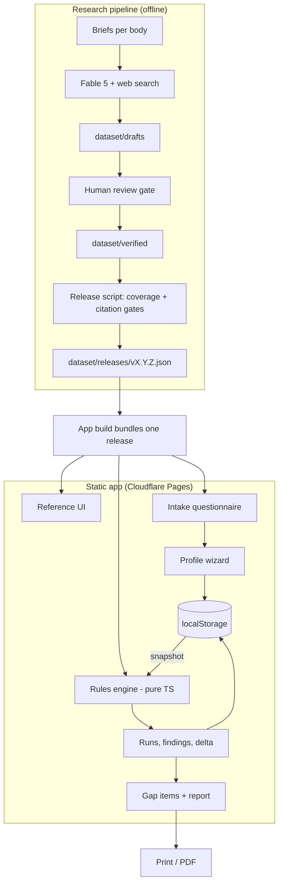
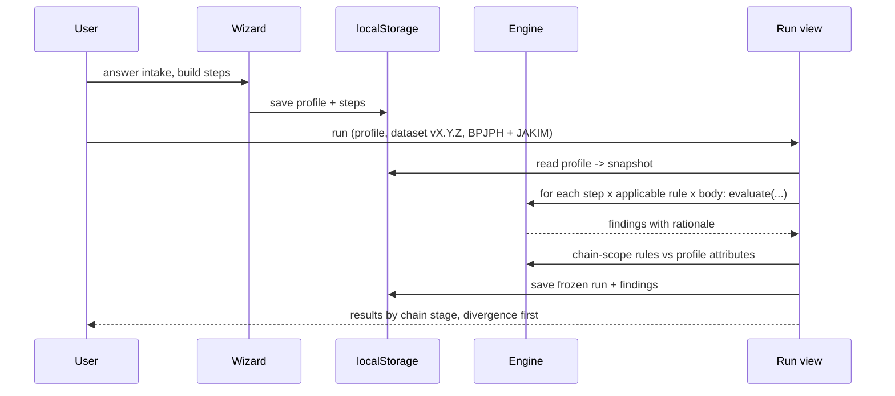

# HALCHECK Architecture

## 1. Summary

HALCHECK has two layers with a strict wall between them.

- **Reference layer**: the dataset. Built offline by an AI-assisted research pipeline, checked by a human, frozen into versioned JSON files.
- **Screening layer**: profiles, runs, findings, reports. Runs fully in the browser using a pure rules engine.

AI exists only on the left side of the review gate. Verdicts exist only on the right side.

```text
 RESEARCH TIME (offline, per release)      RUN TIME (in the browser)
 -------------------------------------    -----------------------------
 research brief (per body)                 profile (chain steps)
      |                                          |
 Fable 5 + web search                      profile snapshot
      |                                          |
 draft JSON (committed as-is)              +-----------------+
      |                                    |  rules engine   |  pure fn
 HUMAN REVIEW GATE                         +-----------------+
      |                                          |
 verified JSON                             findings (4 verdicts)
      |                                          |
 release vX.Y.Z (frozen file) ---------->  gap items -> report
      bundled into the app build
```

## 2. Component Diagram



## 3. Layer Wall

Reference layer owns: bodies, source documents, criteria, rules, recognitions, releases.
Screening layer owns: profiles, steps, snapshots, runs, findings, overrides, gap items.

Rules of the wall:

- The screening layer reads only the bundled release. Never draft or verified files.
- The reference layer knows nothing about any company.
- The engine imports from neither layer. It receives plain objects and returns plain objects.

## 4. Screening Run Flow



Notes: the whole run is one synchronous local pass, well under a second. Findings store their rationale, so old runs render forever without the engine.

## 5. Override Flow

- User opens a finding (example: engine says non_compliant).
- User overrides to conditional and must type a reason.
- The override is a new record. The finding never changes.
- Every screen and every export shows both: engine verdict and override with reason.

## 6. Dataset Release Flow

```text
regulation change noticed (staleness badge helps)
 -> update the body's brief if needed
 -> run Fable 5 research for that body
 -> commit draft JSON unchanged
 -> human review: check every citation against the source
 -> promote to verified (git diff = review record)
 -> release script: schema check, cell coverage check, citation check
 -> tag vX.Y.Z, bundle into next app deploy
 -> old runs stay pinned to their old version
```

The script fails closed. One missing citation or one unresolved cell blocks the release.

## 7. Verdict Model

```text
insufficient_info  a needed attribute is unknown -> names what is missing
non_compliant      an attribute clearly fails the rule
conditional        passes only if outside evidence holds
                   (example: cleaning protocol claimed but not verified)
compliant          every checked attribute passes
```

Order inside one check: insufficient_info stops first, then non_compliant, then conditional, then compliant. So "compliant" always means: all data was present and all of it passed.

## 8. Attribute Contracts (the 8 criteria)

These contracts live as typed definitions in `engine/types.ts`. The research brief schema is generated from them.

```text
segregation           mode: dedicated_required | shared_with_protocol | shared_allowed
                      acceptedProtocols: [ritual_cleansing, documented_sanitation, ...]
transportation        dedication: vehicle | container | none_specified
                      sharedConditions, fleetCertRequired
traceability_documentation   requiredRecords[], retentionPeriod, scope (chain-level)
critical_control_points      mandatorySteps[], optionalSteps[]
contamination_tolerance      tolerance: zero | threshold(value) | unspecified
third_party_certification    required: yes | no | conditional(scope)
audit_cycle           auditFrequency, renewalPeriod
mutual_recognition    stored in Recognition records (one-way)
```

Cosmetics note: production ritual and ingredient rules (alcohol, animal-derived materials) are out of scope. A supplier step with the ingredient-sensitivity flag gets an out-of-scope marker in results, telling the user this needs a formula-level check outside HALCHECK.

## 9. Research Brief (template)

One brief per body in `dataset/briefs/`. Core instruction:

> Research the current published halal certification requirements of **{BODY}** for the **cosmetics** sector, covering supply chain and logistics only: segregation in storage and handling, transportation, traceability and documentation, critical control points from sourcing to retail, cross-contamination tolerance, third-party/3PL certification duties, audit frequency and renewal, and mutual recognition with the other tracked bodies. Sources for BPJPH include UU 33/2014, PP 42/2024, and BPJPH regulations and cosmetics guidance. Sources for JAKIM include MS 2634:2019, the MS 2400 supply chain series, and MPPHM 2020. For every requirement, output one JSON record matching the attached schema: English summary, word-for-word original quote where the clause is accessible, structured attributes per the contract, source document, clause reference, publication date, retrieval date. If the body is silent on a criterion, output a silence record listing the sources you checked. If a source is paywalled or print-only, set `source_access_limited` and cite at document level. Do not guess: no published rule means a silence record.

Language rule: model translation is a draft. The review gate reads the original for every clause-level citation, or downgrades it honestly.

## 10. Report Export

- A print-optimized route rendering only stored run data.
- Section order: cover (client, date, fictional-data label) -> summary -> method (dataset version, standards, engine version, overrides) -> gap items by stage and priority -> export-readiness delta (multi-standard runs) -> data-request list -> disclaimer footer.
- Browser print produces the PDF in v0.3.

## 11. Security Boundaries

- **Truth boundary**: the human review gate. Nothing unreviewed reaches verdicts.
- **Integrity boundary**: the release script gates and frozen release files.
- **Accountability boundary**: overrides always carry a reason and never hide the engine verdict.
- **Privacy boundary**: visitor data never leaves the browser. There is no server to send it to.

## 12. Built-in Extension Points (not v1 work)

- Sector field on every rule (food, pharma later).
- New bodies are new data rows plus a bigger coverage gate, not new schema.
- The engine can move server-side unchanged if v2 ever adds a backend (`12_V2_BACKEND_CONCEPT.md`).
