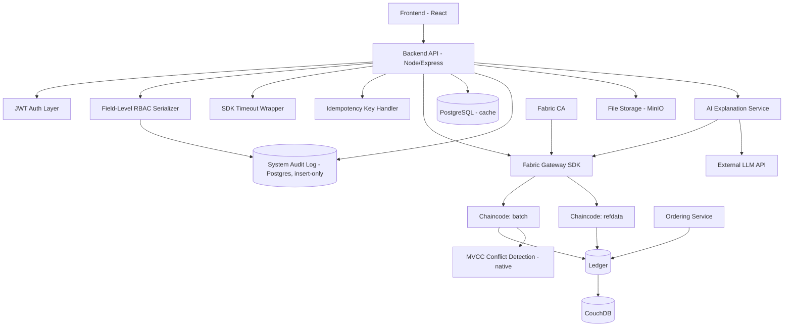
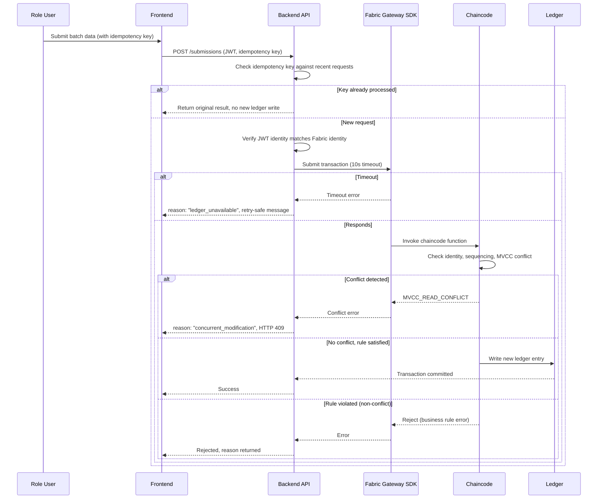
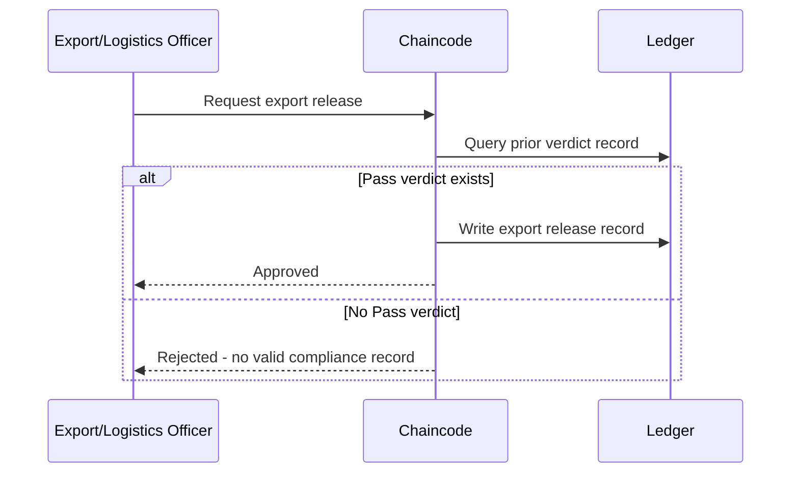
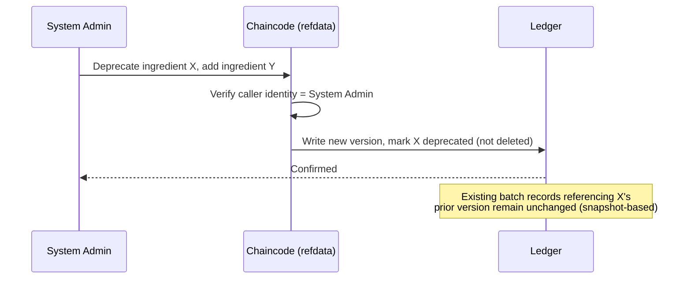

# HALCHECK — Architecture

## Document Control

- Project: HALCHECK
- Module: Compliance Trail
- Repository: `halcheck`
- Status: Design complete
- Version: 0.2.0-planning

## Changelog

- **v0.2.0:** Added Intended Market to batch creation, flagged-record linkage on Fail verdicts, and single-record correction semantics.

## 1. Architecture Summary

Ledger-first: the blockchain network owns all accountability-relevant state. This includes reference data (versioned, on-ledger) alongside batch records. Two non-ledger stores join the system: the System Audit Log (Postgres, insert-only at the grant level) and a stateless LLM API call for trail explanation — neither is authoritative, both are strictly bounded in what they can do.

```text
                Frontend (browser)
                       |
                  Backend API
         +-------------+-------------+-------------+
         |             |             |             |
   Fabric Gateway   PostgreSQL   File Storage    LLM API
       SDK          (cache +      (MinIO)      (stateless,
         |          audit log)                  read-only
    Chaincode                                    context)
   +--------+
   | batch  |
   | refdata|
   +--------+
         |
   +-----+------+------+
   |            |       |
Ledger    CouchDB   File Storage
```

## 2. High-Level Component Diagram



## 3. Runtime Boundary

### Core (authoritative)
- Chaincode — two independently deployable modules: `batch` and `refdata`
- Ledger + ordering service, CouchDB, Fabric CA
- System Audit Log — authoritative for system-level events specifically, though a separate store from the ledger (see Section 7)

### Adapters (non-authoritative)
- Frontend
- Backend API, including the RBAC serializer, SDK timeout wrapper, idempotency handler, and AI Explanation Service
- PostgreSQL cache
- File storage
- LLM API — the least trusted adapter in the system; receives only pre-filtered, server-retrieved context, never direct data access

Adapters may format, display, cache, and relay. They must not independently enforce a rule that chaincode doesn't also enforce.

## 4. Request Flow



## 5. Enforcement Flow



The check happens inside chaincode, not the frontend or backend. A rejected transaction is never partially applied — chaincode transactions are atomic.

## 6. Reference Data Enforcement Flow



## 7. Why the Audit Log Is a Separate Store, Not Ledger Data

Business events (ingredient submissions, verdicts) belong on the ledger because they're the actual accountability claim of the product. System-level events (logins, page views, failed access attempts) are operationally necessary but would bloat the ledger with high-frequency, low-stakes noise if stored there. Postgres with DB-grant-enforced insert-only semantics gives tamper-resistance for practical purposes without forcing every page view through a blockchain transaction — a proportionate design choice.

## 8. Batch Lifecycle Flow

```text
batch creation with intended market (role: Ingredient QA)
  -> ingredient submission (role: Ingredient QA)
  -> production confirmation (role: Production QA, requires prior ingredient record)
  -> compliance verdict (role: Compliance Officer, wraps existing rule engine, BINDING per FRD-CHAIN-VERDICT-005)
       |
       +-- Pass --> export release request (role: Export/Logistics Officer)
       |
       +-- Fail --> batch status: "Awaiting Correction"
                     routes back into Ingredient QA's filtered Batch List
                     -> correction supersedes flagged record only
                     -> re-enters flow at production confirmation
```

This is the concrete architectural expression of the Fail-correction routing fix — the batch's computed status (derived, not stored) explicitly includes an "Awaiting Correction" state that Ingredient QA's Batch List filter checks for. Corrections are no longer whole-ingredient-set resubmissions; the correction record points to the single flagged prior record.

## 9. Data Model

Full entity detail lives in `06_erd.md` — this section is a cross-referenced summary, not a duplicate:

| Record type | Written by | Immutable? | Linkage |
|---|---|---|---|
| Batch | Ingredient QA at creation | Yes | Immutable intended market |
| Ingredient / Production / Verdict / Export | Respective role | Yes, supersede-only | Denormalized snapshots; Fail verdicts flag the triggering record |
| Reference Entry | System Admin | Yes, supersede-only | Self-referencing |
| Audit Log Entry | System (automatic) | Yes, DB-grant enforced | Enum `action` |

## 10. Off-Chain Data Layout

```text
postgresql/
|-- users
|-- cached_batch_views          -- indexed: batch_id, status, timestamp
`-- system_audit_log             -- indexed: timestamp; action field is enum

minio/
|-- {batchId}/{recordType}/{hash}.{ext}
```

## 11. Event Model

```text
# Ledger-originated (via chaincode)
batch.created
ingredient.submitted
ingredient.corrected
production.confirmed
verdict.recorded
export.requested
export.rejected
refdata.added
refdata.deprecated

# Application-level (non-authoritative)
session.authenticated
ui.view.loaded
cache.refreshed
ai.explanation.requested

# Audit-log-originated (system-level)
audit.login
audit.access_denied
audit.field_restricted_access_attempt
```

## 12. Security Architecture

- Identity verification happens twice: JWT layer and chaincode layer — applies identically to System Admin actions on reference data.
- Field-level RBAC enforced in the serialization layer before any response leaves the backend.
- LLM API calls are strictly outbound-context-only — no credentials, no direct data access, no function-calling capability.
- Audit log write access enforced at the PostgreSQL grant level, holds even against an application-layer bug.
- **Encryption at rest:** not configured for local Docker volumes in this version — acceptable given synthetic demo data; would require explicit configuration before any real data would be appropriate.
- Concurrency handling relies on ledger-native MVCC, not a custom lock-management component that would itself need threat-modeling.

## 13. Deployment / Access Architecture

Tunnel scoped to frontend + backend API ports only. Admin-only routes (reference data, audit log) are reachable through the same tunnel as regular routes (still frontend/API-layer, just role-gated) — not a new exposure surface.

```text
[Public tunnel] --> [Frontend : exposed]
                 --> [Backend API : exposed]

[NOT exposed through tunnel]
  - Ledger / peer ports
  - CouchDB
  - Fabric CA admin endpoint
  - MinIO console
  - PostgreSQL
```

## 14. Platform Baseline

| Platform | Status |
|---|---|
| macOS (Apple Silicon) | Primary target |
| Linux | Compatible |
| Windows | Out of scope for this release |

## 15. Known Architectural Limitations

- Single-network topology — one organization's infrastructure hosts the whole network, not independently-operated peers per real-world organization.
- No redundancy — one host machine, no failover.
- No continuous uptime guarantee.
- Audit log and ledger are two separate stores — a deliberate design trade-off (Section 7), not an oversight.
- LLM API is an external dependency — if unreachable, the explanation feature degrades gracefully (explicit "unavailable" message) rather than blocking any core batch functionality.
- Encryption at rest not configured — acceptable for synthetic demo data.
- No audit log retention/archival policy — acceptable at demo scale, flagged as a gap for any future scaling.
- Privacy: this system is not designed or intended to store real personal data; all identities in this version are fictional demonstration personas.

### Failure-Mode Table

| Component failure | Blast radius | Degradation behavior |
|---|---|---|
| Fabric peer/orderer down | Total — no submissions or reads possible | Backend returns `ledger_unavailable` after timeout; no partial function |
| CouchDB down | Query/read degraded | Cached PostgreSQL views still serve reads; new writes still succeed via ledger directly |
| PostgreSQL down | Cache/audit logging lost | Ledger writes still succeed (source of truth unaffected); reads fall back to slower direct-ledger queries; audit logging pauses — System Admin would need to notice on recovery |
| MinIO down | File-dependent actions degraded | Ingredient upload requiring file attachment fails; already-recorded ledger text data remains fully accessible |
| LLM API unreachable | AI Explanation only | Graceful "unavailable" message; zero impact on any core batch workflow |
