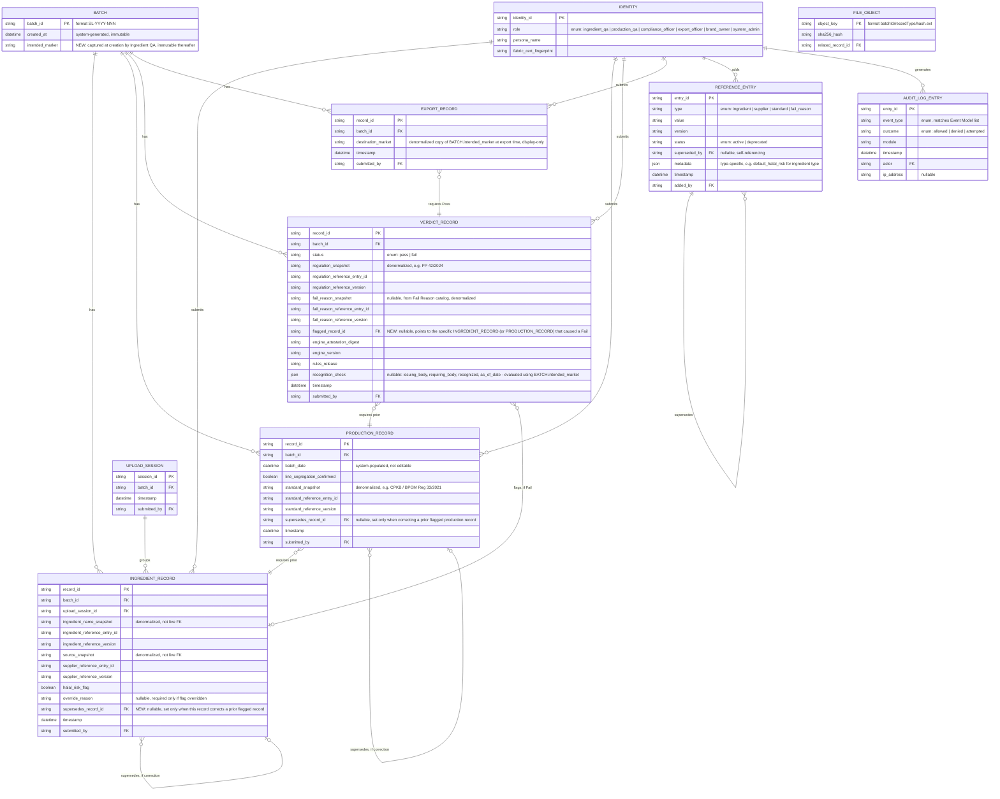

# HALCHECK — Entity-Relationship Diagram (ERD)

## Document Control

- Project: HALCHECK
- Module: Compliance Trail
- Repository: `halcheck`
- Status: Design complete
- Version: 0.3.0-planning

## Changelog

- **v0.2.0:** Added `BATCH.intended_market` (captures destination at creation, resolves recognition-directionality sequencing). Added `VERDICT_RECORD.flagged_record_id` (points to the specific record that caused a Fail). Added `INGREDIENT_RECORD.supersedes_record_id` (correction now supersedes one flagged record, not the whole ingredient set).
- **v0.3.0:** Added verifiable engine-attestation fields, versioned reference snapshots, audit outcome fields, and production-record correction linkage.

## 1. Purpose

Formal, complete entity definitions for every data structure in the system — ledger-authoritative and cache/off-chain alike — so Build has an actual schema to implement against rather than inferring one from prose. Referenced by `04_trd.md` Section 4 as the authoritative version.

## 2. Full Diagram

## 3. Entity Dictionary

### `BATCH`
Deliberately minimal, with one addition: `intended_market` is now captured at creation time (not at export), because the compliance engine's recognition-directionality check depends on which jurisdiction the batch is headed to — that value must exist before the verdict is computed, not after. `batch_id` is the business key (not an internal surrogate), matching the human-readable `SL-YYYY-NNN` format. Status is never stored here — it's derived from the latest child record present, computed by the backend and cached in PostgreSQL.

### `IDENTITY`
Represents any of the 6 roles' real Fabric identities. `role` is a fixed enum of exactly 6 values; no seventh value should ever be possible given the closed role model this project holds throughout.

### `UPLOAD_SESSION`
Exists purely to group ingredient records visually — no independent business meaning beyond that grouping.

### `INGREDIENT_RECORD`
`ingredient_name_snapshot` and `source_snapshot` are the literal resolved text plus version from the Reference Lists at submission time — not live foreign keys. `override_reason` is nullable, populated only when the Halal Risk Flag is manually overridden. `supersedes_record_id` is set only for a correction of the specific flagged ingredient record. All other ingredient records are untouched and never resubmitted.

### `PRODUCTION_RECORD`
`batch_date` is explicitly system-populated. `supersedes_record_id` follows the same append-only correction rule as ingredient records when a Fail flags production.

### `VERDICT_RECORD`
`recognition_check` is stored as a JSON blob evaluated using `BATCH.intended_market`. When `status = fail`, `flagged_record_id` points to the specific ingredient or production record that caused the failure. `engine_attestation_digest`, `engine_version`, and `rules_release` make the binding engine result verifiable and historically attributable. `status` remains a strict two-value enum.

### `EXPORT_RECORD`
`destination_market` is now a denormalized copy of `BATCH.intended_market`, captured for the export record's own historical snapshot — it is no longer a value chosen at export time; the Export Request Form displays it read-only.

### `REFERENCE_ENTRY`
The one entity with a genuine self-referencing relationship (`superseded_by`) — makes the supersede-never-delete pattern queryable.

### `AUDIT_LOG_ENTRY`
`event_type` and `outcome` are closed database-enforced enums, matching the Event Model in the Architecture document; neither is free text.

### `FILE_OBJECT`
Not a full entity in the traditional sense — more a lookup convention than a table with independent lifecycle.

## 4. Cardinality Notes

- One `BATCH` has zero-or-one of each child record type at any given point in its lifecycle, but potentially many over time through corrections — the `||--o{` notation reflects the cumulative relationship across the batch's full history.
- `VERDICT_RECORD` to `INGREDIENT_RECORD` (via `flagged_record_id`) is optional (zero-or-one) — only populated for Fail verdicts.
- `INGREDIENT_RECORD` and `PRODUCTION_RECORD` each self-reference through `supersedes_record_id` only for correction submissions. Superseded status is derived from the linked successor; prior ledger records are never updated.
- `IDENTITY` to every record type is one-to-many — one identity submits many records over time.
- `REFERENCE_ENTRY` to itself is the only other reflexive relationship in the model, capturing version history without a separate history table.

## 5. What's Deliberately Not Modeled

- No `USER_SESSION` entity — session state lives entirely in the JWT itself.
- No `NOTIFICATION` entity — the "N batches awaiting your action" indicator is computed on read from existing Batch List filtering logic.
- No separate `HASH_LOG` or blockchain-internal structures — those are Fabric's own internal ledger mechanics.
- No correction record type beyond ingredients and production is modeled; a Fail must identify one of those concrete upstream record types.
