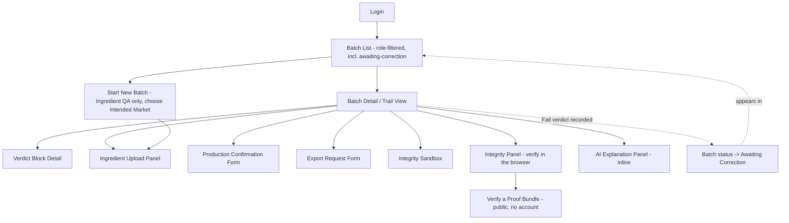
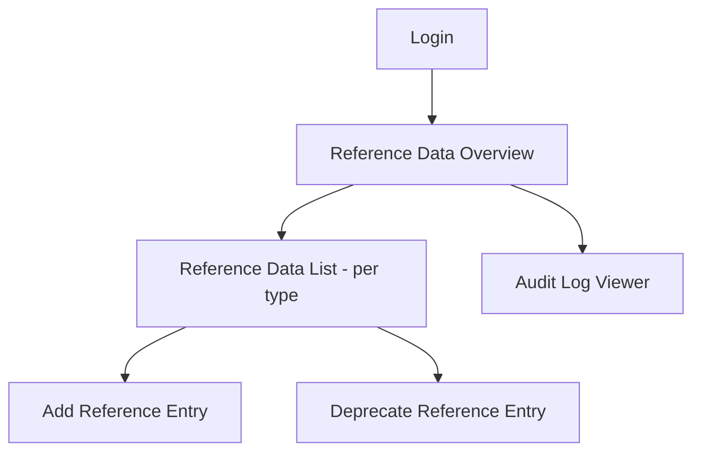

# HALCHECK — UI Flow & Navigation

## Document Control

- Project: HALCHECK
- Module: Compliance Trail
- Repository: `halcheck`
- Status: Design complete
- Version: 0.2.0-planning

## Changelog

- **v0.2.0:** Batch creation now captures Intended Market before ingredient upload. Tamper-Evidence Sandbox route language updated to Integrity Sandbox.

## 1. Purpose

Defines navigation, information architecture, and per-screen requirements — the layer between "what a component contains" (UI Specification) and "how someone actually moves through the app." Covers two structurally different users: the 5 operational roles (batch-centric navigation) and System Admin (governance-centric navigation) — a real structural fork, not just one more row in a table.

## 2. Platform Scope

Desktop and tablet: full navigation for all 6 roles. Mobile: navigation exists but leads only to view-only destinations for operational roles, plus the AI Explanation Panel exception (per UI Specification Section 7). System Admin has no mobile presence at all, not even view-only.

## 3. Information Architecture — Per-Role Landing

| Role | Lands on after login |
|---|---|
| Ingredient QA | Batch list, filtered to batches awaiting ingredient submission or awaiting correction |
| Production QA | Batch list, filtered to batches awaiting production record |
| Compliance Officer | Batch list, filtered to batches awaiting verdict |
| Export/Logistics Officer | Batch list, filtered to Pass-verdict batches awaiting export |
| Brand Owner | Full batch list, unfiltered, read-only |
| System Admin | Reference Data Overview — never the batch list, not even filtered/read-only |

**Two shells, not one.** Operational roles share the batch-list shell. System Admin gets its own shell entirely — a governance shell, with no batch-list route accessible to it at all. This is the navigation-level expression of "System Admin has no batch involvement whatsoever," not just a permission-level statement.

## 4. Navigation Map — Operational Shell

Every action screen returns to Batch Detail on completion or cancel — flat, one-level-deep structure. The dotted lines represent automatic status-driven routing, not a user-navigated path.

## 5. Navigation Map — Governance Shell

Both shells share only the Login screen — after authentication, a System Admin identity is routed to the governance shell and never sees the operational shell's routes at all, not even as disabled/greyed-out navigation items.

## 6. Route Table

| Route | Accessible to | Redirects if unauthorized |
|---|---|---|
| `/login` | Everyone | — |
| `/verify` | Everyone — no session required (ADR-CT-034: verification must not need an account) | — |
| `/batches` | 5 operational roles; filter includes `awaiting_ingredients` and `awaiting_correction` for Ingredient QA | → `/login` if session expired; → `/admin` if authenticated as System Admin |
| `/batches/:id` | 5 operational roles | → `/batches` if batch doesn't exist |
| `/batches/:id/ingredients` | Ingredient QA only | → `/batches/:id` with plain-text reason if wrong role |
| `/batches/:id/production` | Production QA only | Same pattern |
| `/batches/:id/verdict` | Compliance Officer only | Same pattern |
| `/batches/:id/export` | Export/Logistics Officer only | Same pattern |
| `/batches/:id/integrity-sandbox` | All 5 operational roles | — |
| `/batches/:id/integrity` | All 5 operational roles | — |
| `/batches/:id/explain` | All 5 operational roles (inline on Batch Detail) | — |
| `/admin` | System Admin only | → `/batches` if any operational role attempts it |
| `/admin/reference-data/:type` | System Admin only | Same pattern |
| `/admin/audit-log` | System Admin only | Same pattern — the route T-019's negative test targets directly |

## 7. Session Handling

- Logout: explicit action available from the persistent RoleContextBar at all times, identical for all 6 roles.
- Session expiry: JWT expiry (8h) triggers redirect to `/login` with a plain message ("Session expired, please log in again").
- No "stay logged in" option.
- Direct URL access to an unauthorized route: redirects per Section 6's table, never a blank/broken page.

## 8. Batch Creation Flow

Starting a new batch (Ingredient QA only) captures Intended Market first, then generates a system-assigned batch ID and moves directly into the Ingredient Upload Panel scoped to that ID. A correction submission from an "Awaiting Correction" batch uses the Ingredient Upload Panel in correction mode, pre-scoped to the single flagged record identified by the Fail verdict.

## 9. First-Use / Onboarding Path

No dedicated onboarding screens or wizard. First login for any role lands on its landing view in its empty state, carrying a short plain-language line on what that role does and what to do next (e.g., for System Admin: "No reference data configured yet — add your first ingredient, supplier, or standard to begin").

## 10. Notification Indicator

**Placement:** small badge on the RoleContextBar, visible immediately on login and persistently thereafter.

**Content:** "N batches awaiting your action" — computed from the same filtered Batch List query already run for that role's landing view, not a separate data source.

**Behavior:**
- Updates on each Batch List load — no real-time push mechanism.
- Clicking the badge navigates to the Batch List, already filtered as normal.
- Zero state: badge doesn't render at all when the count is zero.

This closes the notification gap without new infrastructure — the underlying data (which batches need which role's action) already exists via the filtered query powering Batch List itself.

## 11. What This Document Deliberately Does Not Cover

Field content → Screen Requirements. Visual states/styling → UI Specification.
